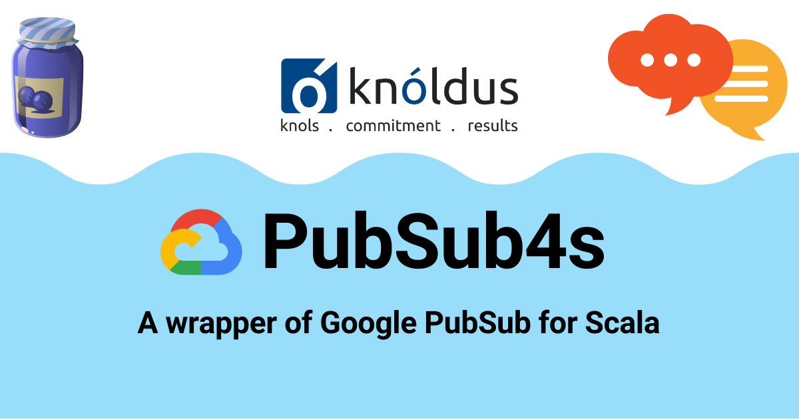

***
# Google PubSub4S
___


A wrapper of Google PubSub for Scala

## Usage
___

### Library

```scala
libraryDependencies += "knoldus" % "pubsub4s" % "0.1.1-SNAPSHOT"
```

### Create Publisher

```scala
val topicName = TopicName.of("<PROJECT-ID>", "<TOPIC-NAME>")

val credentialFile = "[JSON-FILE]"

val googleCredentials = GoogleCredentials.fromStream(new FileInputStream(new File(credentialFile)))

val credentialsProvider = FixedCredentialsProvider.create(googleCredentials)

val publisher = PublisherBuilder.make(topicName).withCredentials(credentialsProvider).build
```

### Creating PubSubMessage to Publish

```scala
val pubSubMessage = PubSubMessageBuilder.make.withMessageId("message-id").withMessage("my-message").build

val messageId = publisher.publish(pubSubMessage)
```

### Creating Subscriber

```scala
val projectSubscriptionName = ProjectSubscriptionName.of("<PROJECT-ID>", "<SUBSCRIPTION-ID>")
 
val receiver: Receiver  = (msg: PubSubMessage, consumer: AckReplyConsumer) => {
    println(s"Message Received: ${msg.getMessageId} - ${msg.getDataString}")
    consumer.ack()
}
 
val subscriber: Subscriber = SubscriberBuilder.make(projectSubscriptionName, receiver).build

subscriber.startAsync()

subscriber.stopAsync()

subscriber.awaitTerminated()
```

---
&copy; 2022 [Knoldus Inc.](http://www.knoldus.com/)
